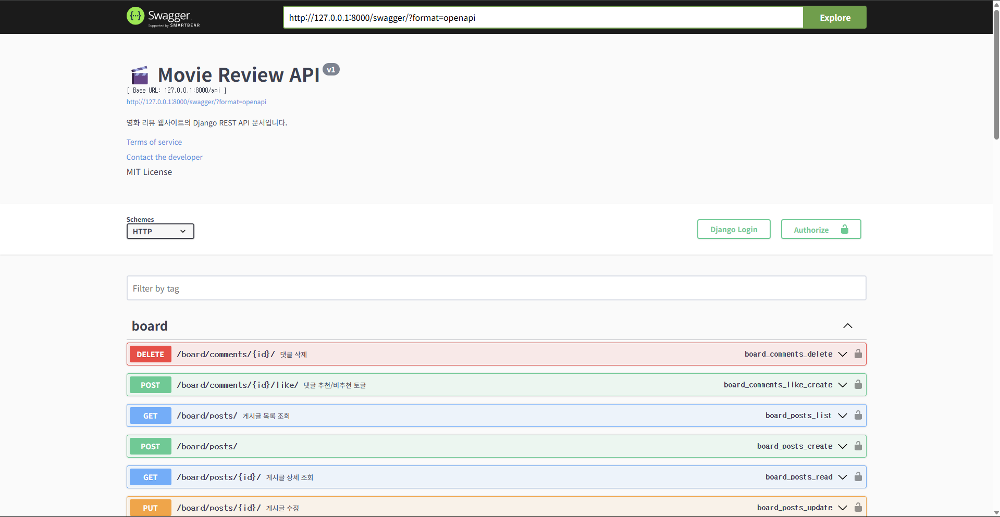

# 🎬 영화 리뷰 플랫폼


> 사용자들이 영화를 검색하고, 리뷰를 작성하고, 커뮤니티에서 소통할 수 있는 웹 애플리케이션입니다.

---

## 📑 목차

- [🔧 주요 기능](#-주요-기능)
- [🗂 기술 스택](#-기술-스택)
- [📁 프로젝트 구조](#-프로젝트-구조-백엔드-기준-예시)
- [🚀 실행 방법](#-실행-방법)
- [🔐 JWT 인증 사용법](#-jwt-인증-사용법-swagger-기준)
- [🛠 향후 계획](#-향후-계획)
- [📄 라이선스](#-라이선스)
- [🙌 기여 방법](#-기여-방법)

---

## 🔧 주요 기능

### ✅ 사용자 기능
- **JWT 기반 회원가입 / 로그인 / 토큰 발급**
- **프로필 조회 및 OTT 구독 설정**
- **Access/Refresh 토큰 기반 인증 시스템**
- **Swagger UI에서 Authorization 헤더 인증 테스트 가능**
- **OTT 구독 모델과 사용자 연결 구조 구현 완료**

### ✅ OTT 플랫폼 관리
- **OTT 모델 구현 (이름, 로고 URL 포함)**
- **영화와 다대다(ManyToMany) 관계 설정 완료**

### ✅ 영화 기능
- **영화 등록, 목록 조회, 상세 보기, 수정/삭제**
- **영화 정렬 기능**: 평점, 개봉일, 제목 등 기준별 정렬
- **OTT 플랫폼과의 다대다 연결**
- **제목 검색 및 OTT 필터링 기능**
- **평균 평점 캐시 저장 및 정렬 최적화**
- **Movie 모델: 제목, 설명, 개봉일, 썸네일 URL, OTT 연결, 평균 평점 캐시 필드 포함**
- **CRUD API 구현 완료: 영화 등록, 목록 조회, 상세 조회, 수정, 삭제**
- **정렬 기능: `ordering=average_rating|release_date|title` 쿼리 지원**
- **Swagger 문서화 및 테스트 가능**

### ✅ 검색 및 필터
- **제목 기반 검색 (SearchFilter)**
- **OTT 플랫폼 필터링 (django-filter)**
- **`/api/movies/search/?search=키워드&ott_services=1,2` 형태로 사용 가능**
- **Swagger에 필터 설명 포함**

### ✅ 리뷰 기능
- **영화별 리뷰 작성, 수정, 삭제**
- **평점 입력 (1~5점) 및 영화별 평균 평점 자동 계산**
- **리뷰 좋아요 기능 (ReviewLike 모델)**
- **리뷰 댓글 기능 (ReviewComment 모델)**
- **Review 모델: 평점, 코멘트, 작성자, 영화 연결**
- **ReviewLike 모델: 사용자-리뷰 좋아요 (unique_together 제약)**
- **ReviewComment 모델: 리뷰에 대한 댓글 작성 가능**
- **리뷰 추가/수정/삭제 시 영화 모델의 `average_rating_cache`가 자동으로 갱신되도록 Review 모델의 `save()` 및 `delete()` 오버라이딩**
- **Django Shell로 테스트 시 캐시 정확히 반영됨 확인**


### ✅ 게시판 기능
- **게시글 작성 및 조회**
- **게시글에 댓글 작성**
- **게시글 추천/비추천 기능 (좋아요/싫어요)**
- **주제별 게시판 분리**: 영화 정보, 국내 드라마 등 카테고리 구분
- **일일/월간 핫글 게시판**: 추천수를 기준으로 인기 게시글을 자동 분류
- **댓글 정렬**: 추천수 상위 3개 댓글 우선 표시 + 이후 댓글은 작성 순

### ✅ API 문서화 (Swagger)
- **drf-yasg를 통한 자동 문서화**
- **한글 설명 제공**
- **Swagger UI에서 직접 테스트 가능** (`/swagger/`)

#### 🔍 Swagger 미리보기




### ⚙️ 시스템 설정 및 성능 최적화
- **CORS 설정 완료 (React 연동 대비)**
- **django_filters 설정 완료**
- **REST_FRAMEWORK 설정 정리 완료 (인증, 필터 등)**

### 🧩 주요 이슈 해결 내역
- **`average_rating_cache` 필드 마이그레이션 누락 → 정상 반영**
- **리뷰 모델에 `updated_at` 필드 추가 후 마이그레이션 → 적용 완료**
- **`average_rating()` 함수 정렬 오류 → 캐시 필드 기반 정렬로 변경**
- **Swagger에서 영화 등록/검색/리뷰 작성 API 테스트 완료**

---

## 🗂 기술 스택

| 구분       | 기술 |
|------------|------|
| **Backend** | Django, Django REST Framework, SimpleJWT |
| **Frontend** | React (예정) |
| **DB**      | PostgreSQL or SQLite |
| **Docs**    | Swagger (drf-yasg) |
| **Auth**    | JWT (Access/Refresh Token) |
| **DevOps**  | GitHub, Docker (예정) |

---

## 📁 프로젝트 구조 (백엔드 기준 예시)

```
backend/
├── config/                     # Django 프로젝트 설정 폴더
│   ├── settings.py             # 전체 설정
│   ├── urls.py                 # 전역 URL 라우팅
│   └── wsgi.py / asgi.py       # 배포용 설정
│
├── users/                      # 사용자 앱
│   ├── models.py               # 사용자 모델 (AbstractUser 확장 가능)
│   ├── views.py                # 회원가입, 프로필, 구독 API
│   ├── serializers.py
│   ├── urls.py
│   └── permissions.py
│
├── movies/                     # 영화 앱
│   ├── models.py               # 영화 + OTT ManyToMany
│   ├── views.py                # 조회, 등록, 정렬 등
│   ├── serializers.py
│   └── urls.py
│
├── reviews/                    # 리뷰 + 댓글 + 좋아요
│   ├── models.py
│   ├── views.py
│   ├── serializers.py
│   ├── permissions.py
│   └── urls.py
│
├── ott/                        # OTT 플랫폼 (넷플릭스 등)
│   ├── models.py
│   ├── serializers.py
│   └── urls.py
|
├── board/                      # 게시판 앱
│   ├── models.py               
│   ├── views.py                # 작성, 삭제 등등
│   ├── serializers.py
│   └── urls.py
│
├── manage.py                   # Django 실행 파일
├── requirements.txt            # 패키지 목록
└── db.sqlite3 (또는 PostgreSQL 사용 가능)
```

---

## 🚀 실행 방법

### 1. 가상환경 설치 및 패키지 설치

```bash
python -m venv venv
source venv/bin/activate  # Windows: venv\Scripts\activate
pip install -r requirements.txt
```

### 2. 마이그레이션 및 서버 실행

```bash
python manage.py makemigrations
python manage.py migrate
python manage.py runserver
```

### 3. Swagger 접속

```
http://localhost:8000/swagger/
```

---

## 🔐 JWT 인증 사용법 (Swagger에서)

1. `/api/token/`에서 access, refresh 토큰 발급
2. Swagger 우측 상단 Authorize 클릭
3. `Bearer <access_token>` 형식으로 입력 후 인증

---

## 🛠 향후 계획

- React 기반 프론트엔드 연동
- Django Admin 페이지 커스터마이징
- Docker 배포 자동화

---

## 📄 라이선스
 - 이 프로젝트는 MIT 라이선스를 따릅니다.

---

## 🙌 기여 방법

1. 이 저장소를 fork 합니다.
2. 새로운 브랜치를 만듭니다 (`git checkout -b feature/my-feature`)
3. 변경사항을 커밋합니다 (`git commit -m 'Add my feature'`)
4. PR을 보냅니다!

---