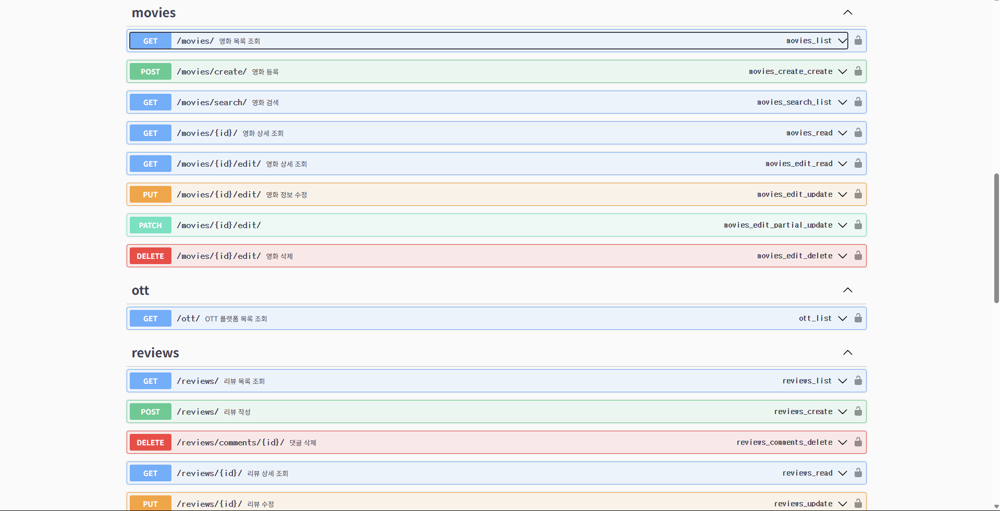

## 🔧 주요 기능

### ✅ 사용자 기능
- **JWT 기반 회원가입 / 로그인 / 토큰 발급**
- **프로필 조회 및 OTT 구독 설정**
- **Access/Refresh 토큰 기반 인증 시스템**
- **Swagger UI에서 Authorization 헤더 인증 테스트 가능**
- **OTT 구독 모델과 사용자 연결 구조 구현 완료**

### ✅ OTT 플랫폼 관리
- **OTT 모델 구현 (이름, 로고 URL 포함)**
- **영화와 다대다(ManyToMany) 관계 설정 완료**

### ✅ 영화 기능
- **영화 등록, 목록 조회, 상세 보기, 수정/삭제**
- **영화 정렬 기능**: 평점, 개봉일, 제목 등 기준별 정렬
- **OTT 플랫폼과의 다대다 연결**
- **제목 검색 및 OTT 필터링 기능**
- **평균 평점 캐시 저장 및 정렬 최적화**
- **Movie 모델: 제목, 설명, 개봉일, 썸네일 URL, OTT 연결, 평균 평점 캐시 필드 포함**
- **CRUD API 구현 완료: 영화 등록, 목록 조회, 상세 조회, 수정, 삭제**
- **정렬 기능: `ordering=average_rating|release_date|title` 쿼리 지원**
- **Swagger 문서화 및 테스트 가능**

### ✅ 검색 및 필터
- **제목 기반 검색 (SearchFilter)**
- **OTT 플랫폼 필터링 (django-filter)**
- **`/api/movies/search/?search=키워드&ott_services=1,2` 형태로 사용 가능**
- **Swagger에 필터 설명 포함**

### ✅ 리뷰 기능
- **영화별 리뷰 작성, 수정, 삭제**
- **평점 입력 (1~5점) 및 영화별 평균 평점 자동 계산**
- **리뷰 좋아요 기능 (ReviewLike 모델)**
- **리뷰 댓글 기능 (ReviewComment 모델)**
- **Review 모델: 평점, 코멘트, 작성자, 영화 연결**
- **ReviewLike 모델: 사용자-리뷰 좋아요 (unique_together 제약)**
- **ReviewComment 모델: 리뷰에 대한 댓글 작성 가능**
- **리뷰 추가/수정/삭제 시 영화 모델의 `average_rating_cache`가 자동으로 갱신되도록 Review 모델의 `save()` 및 `delete()` 오버라이딩**
- **Django Shell로 테스트 시 캐시 정확히 반영됨 확인**

### ✅ 게시판 기능
- **게시글 작성 및 조회**
- **게시글에 댓글 작성**
- **게시글 추천/비추천 기능 (좋아요/싫어요)**
- **주제별 게시판 분리**: 영화 정보, 국내 드라마 등 카테고리 구분
- **일일/월간 핫글 게시판**: 추천수를 기준으로 인기 게시글을 자동 분류
- **댓글 정렬**: 추천수 상위 3개 댓글 우선 표시 + 이후 댓글은 작성 순

### ✅ API 문서화 (Swagger)
- **drf-yasg를 통한 자동 문서화**
- **한글 설명 제공**
- **Swagger UI에서 직접 테스트 가능** (`/swagger/`)

#### 🔍 Swagger 미리보기

## 📦 API 요약

| 기능 구분     | 메서드 | 엔드포인트 URL                     | 설명                                      |
|--------------|--------|-----------------------------------|-------------------------------------------|
| 🔐 회원가입    | POST   | `/api/users/register/`            | 사용자 회원가입                          |
| 🔐 로그인      | POST   | `/api/token/`                     | JWT access/refresh 토큰 발급              |
| 👤 프로필 조회 | GET    | `/api/users/profile/`             | 현재 로그인한 사용자 정보 조회            |
| 📺 OTT 목록   | GET    | `/api/ott/`                       | 등록된 OTT 플랫폼 목록 조회               |
| 🎥 영화 목록   | GET    | `/api/movies/`                    | 영화 목록 조회 (정렬 기능 포함)           |
| 🎥 영화 등록   | POST   | `/api/movies/`                    | 영화 등록 (OTT 연결 포함)                 |
| 🎥 영화 상세   | GET    | `/api/movies/{id}/`               | 특정 영화 상세 조회                       |
| 🎥 영화 수정   | PUT    | `/api/movies/{id}/`               | 영화 정보 수정                            |
| 🎥 영화 삭제   | DELETE | `/api/movies/{id}/`               | 영화 삭제                                 |
| 🔍 영화 검색   | GET    | `/api/movies/search/`             | 제목 검색 + OTT 필터링                    |
| 📝 리뷰 작성   | POST   | `/api/reviews/`                   | 특정 영화에 대한 리뷰 작성                |
| 📝 리뷰 수정   | PUT    | `/api/reviews/{id}/`              | 리뷰 수정                                 |
| 📝 리뷰 삭제   | DELETE | `/api/reviews/{id}/`              | 리뷰 삭제                                 |
| ❤️ 리뷰 좋아요 | POST   | `/api/review-likes/`              | 리뷰 좋아요 등록                          |
| 💬 리뷰 댓글   | POST   | `/api/review-comments/`           | 리뷰에 댓글 작성                          |
| 📝 게시글 작성 | POST   | `/api/board/posts/`               | 게시판 글 작성                            |
| 📝 게시글 목록 | GET    | `/api/board/posts/`               | 게시판 목록 조회                          |
| 💬 게시글 댓글 | POST   | `/api/board/comments/`            | 게시글에 대한 댓글 작성                   |

### ⚙️ 시스템 설정 및 성능 최적화
- **CORS 설정 완료 (React 연동 대비)**
- **django_filters 설정 완료**
- **REST_FRAMEWORK 설정 정리 완료 (인증, 필터 등)**

### 🧩 주요 이슈 해결 내역
- **`average_rating_cache` 필드 마이그레이션 누락 → 정상 반영**
- **리뷰 모델에 `updated_at` 필드 추가 후 마이그레이션 → 적용 완료**
- **`average_rating()` 함수 정렬 오류 → 캐시 필드 기반 정렬로 변경**
- **Swagger에서 영화 등록/검색/리뷰 작성 API 테스트 완료**

---