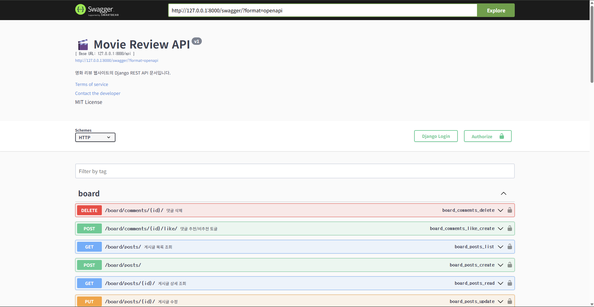

# 🛠 Backend - Django


> Django와 Django REST Framework를 기반으로 사용자 인증, 영화 관리, 리뷰 작성, 게시판 기능 등을 제공하는 백엔드 API입니다.  
> Swagger를 통해 API 문서화 및 테스트를 지원하며, React 프론트엔드와 연동 가능합니다.

---

## 📑 목차

- [🔧 주요 기능](#-주요-기능)
  - [✅ 사용자 기능](#-사용자-기능)
  - [✅ OTT 플랫폼 관리](#-ott-플랫폼-관리)
  - [✅ 영화 기능](#-영화-기능)
  - [✅ 검색 및 필터](#-검색-및-필터)
  - [✅ 리뷰 기능](#-리뷰-기능)
  - [✅ 게시판 기능](#-게시판-기능)
  - [✅ API 문서화 (Swagger)](#-api-문서화-swagger)
- [📦 API 요약](#-api-요약)
- [⚙️ 시스템 설정 및 성능 최적화](#️-시스템-설정-및-성능-최적화)
- [🧩 주요 이슈 해결 내역](#-주요-이슈-해결-내역)
- [🚀 실행 방법](#-실행-방법)
  - [1. 가상환경 설치 및 패키지 설치](#1-가상환경-설치-및-패키지-설치)
  - [2. 마이그레이션 및 서버 실행](#2-마이그레이션-및-서버-실행)
  - [3. Swagger 접속](#3-swagger-접속)
- [🔐 JWT 인증 사용법 (Swagger에서)](#-jwt-인증-사용법-swagger에서)
- [🔗 프론트엔드 연동](#-프론트엔드-연동)

---

## 🔧 주요 기능

### ✅ 사용자 기능
- **JWT 기반 회원가입 / 로그인 / 토큰 발급**
- **프로필 조회 및 OTT 구독 설정**
- **Access/Refresh 토큰 기반 인증 시스템**
- **Swagger UI에서 Authorization 헤더 인증 테스트 가능**
- **OTT 구독 모델과 사용자 연결 구조 구현 완료**

### ✅ OTT 플랫폼 관리
- **OTT 모델 구현 (이름, 로고 URL 포함)**
- **영화와 다대다(ManyToMany) 관계 설정 완료**

### ✅ 영화 기능
- **영화 등록, 목록 조회, 상세 보기, 수정/삭제**
- **영화 정렬 기능**: 평점, 개봉일, 제목 등 기준별 정렬
- **OTT 플랫폼과의 다대다 연결**
- **제목 검색 및 OTT 필터링 기능**
- **평균 평점 캐시 저장 및 정렬 최적화**
- **Movie 모델: 제목, 설명, 개봉일, 썸네일 URL, OTT 연결, 평균 평점 캐시 필드 포함**
- **CRUD API 구현 완료: 영화 등록, 목록 조회, 상세 조회, 수정, 삭제**
- **정렬 기능: `ordering=average_rating|release_date|title` 쿼리 지원**
- **Swagger 문서화 및 테스트 가능**

### ✅ 검색 및 필터
- **제목 기반 검색 (SearchFilter)**
- **OTT 플랫폼 필터링 (django-filter)**
- **`/api/movies/search/?search=키워드&ott_services=1,2` 형태로 사용 가능**
- **Swagger에 필터 설명 포함**

### ✅ 리뷰 기능

- 영화별 리뷰 작성 / 조회 / 수정 / 삭제
- 평점 (1~5점) 및 스포일러 여부(`is_spoiler`) 설정
- 리뷰 추천 / 비추천 (좋아요/싫어요 토글 방식)
- 리뷰 정렬 기능
  - 최신순 (`-created_at`)
  - 평점 높은순 / 낮은순 (`-rating`, `rating`)
  - 추천순 (`-like_count`)
- 리뷰 댓글 기능
  - 댓글 작성 / 삭제
  - 댓글 추천(좋아요) 및 추천순 상위 3개 우선 정렬
- 리뷰 수정 히스토리 기록 (`ReviewHistory`)
  - 수정 시 자동 기록
  - `is_edited` 필드로 수정 여부 제공
  - `/api/reviews/{id}/history/`로 이력 확인 가능
- 리뷰 이미지 첨부 기능
  - 여러 이미지 업로드 가능
  - `/api/reviews/{id}/images/`로 업로드
  - 응답 시 `images` 필드로 포함


### ✅ 게시판 기능
- **게시글 작성 및 조회**
- **게시글에 댓글 작성**
- **게시글 추천/비추천 기능 (좋아요/싫어요)**
- **주제별 게시판 분리**: 영화 정보, 국내 드라마 등 카테고리 구분
- **일일/월간 핫글 게시판**: 추천수를 기준으로 인기 게시글을 자동 분류
- **댓글 정렬 로직직**: 추천수 상위 3개 댓글 우선 표시 + 이후 댓글은 작성 순
- **댓글 추천 API**: `/api/board/comment-likes/` (POST, is_like 필드 포함)

### ✅ API 문서화 (Swagger)
- **drf-yasg를 통한 자동 문서화**
- **한글 설명 제공**
- **Swagger UI에서 직접 테스트 가능** (`/swagger/`)

#### 🔍 Swagger 미리보기




## 📦 API 요약

| 기능 구분     | 메서드 | 엔드포인트 URL                     | 설명                                      |
|--------------|--------|-----------------------------------|-------------------------------------------|
| 🔐 회원가입    | POST   | `/api/users/register/`            | 사용자 회원가입                          |
| 🔐 로그인      | POST   | `/api/token/`                     | JWT access/refresh 토큰 발급              |
| 👤 프로필 조회 | GET    | `/api/users/profile/`             | 현재 로그인한 사용자 정보 조회            |
| 📺 OTT 목록   | GET    | `/api/ott/`                       | 등록된 OTT 플랫폼 목록 조회               |
| 🎥 영화 목록   | GET    | `/api/movies/`                    | 영화 목록 조회 (정렬 기능 포함)           |
| 🎥 영화 등록   | POST   | `/api/movies/`                    | 영화 등록 (OTT 연결 포함)                 |
| 🎥 영화 상세   | GET    | `/api/movies/{id}/`               | 특정 영화 상세 조회                       |
| 🎥 영화 수정   | PUT    | `/api/movies/{id}/`               | 영화 정보 수정                            |
| 🎥 영화 삭제   | DELETE | `/api/movies/{id}/`               | 영화 삭제                                 |
| 🔍 영화 검색   | GET    | `/api/movies/search/`             | 제목 검색 + OTT 필터링                    |
| 📝 리뷰 작성   | POST   | `/api/reviews/`                   | 특정 영화에 대한 리뷰 작성                |
| 📝 리뷰 수정   | PUT    | `/api/reviews/{id}/`              | 리뷰 수정                                 |
| 📝 리뷰 삭제   | DELETE | `/api/reviews/{id}/`              | 리뷰 삭제                                 |
| 📝 리뷰 목록   | GET    | `/api/reviews/?movie_id=ID`       | 특정 영화의 리뷰 목록 조회                |
| ❤️ 리뷰 좋아요 | POST   | `/api/review-likes/`              | 리뷰 좋아요 등록                          |
| ❤️ 리뷰 좋아요 취소 | DELETE | `/api/review-likes/{id}/`       | 좋아요 취소                              |
| 💬 리뷰 댓글   | POST   | `/api/review-comments/`           | 리뷰에 댓글 작성                          |
| 📝 게시글 작성 | POST   | `/api/board/posts/`               | 게시판 글 작성                            |
| 📝 게시글 목록 | GET    | `/api/board/posts/`               | 게시판 목록 조회                          |
| 📝 게시글 수정 | PUT    | `/api/board/posts/{id}/`          | 게시글 수정                              |
| 📝 게시글 삭제 | DELETE | `/api/board/posts/{id}/`          | 게시글 삭제                              |
| 💬 댓글 삭제   | DELETE | `/api/board/comments/{id}/`       | 게시글 댓글 삭제                         |
| 💬 게시글 댓글 | POST   | `/api/board/comments/`            | 게시글에 대한 댓글 작성                   |
| 💬 댓글 삭제   | DELETE | `/api/board/comments/{id}/`       | 게시글 댓글 삭제                         |

### ⚙️ 시스템 설정 및 성능 최적화
- **CORS 설정 완료 (React 연동 대비)**
- **django_filters 설정 완료**
- **REST_FRAMEWORK 설정 정리 완료 (인증, 필터 등)**
- **리뷰 정렬 기능 확장:최신순, 평점순, 추천순 정렬 가능 (ordering 파라미터 지원)**

### 🧩 주요 이슈 해결 내역

#### (2025-05-07)
- **`average_rating_cache` 필드 마이그레이션 누락 → 정상 반영**
- **리뷰 모델에 `updated_at` 필드 추가 후 마이그레이션 → 적용 완료**
- **`average_rating()` 함수 정렬 오류 → 캐시 필드 기반 정렬로 변경**
- **Swagger에서 영화 등록/검색/리뷰 작성 API 테스트 완료**

---

## 🚀 실행 방법

### 1. 가상환경 설치 및 패키지 설치

```bash
python -m venv venv
source venv/bin/activate  # Windows: venv\Scripts\activate
pip install -r requirements.txt
```

### 2. 마이그레이션 및 서버 실행

```bash
python manage.py makemigrations
python manage.py migrate
python manage.py runserver
```

### 3. Swagger 접속

```
http://localhost:8000/swagger/
```

---

## 🔐 JWT 인증 사용법 (Swagger에서)

1. `/api/token/`에서 access, refresh 토큰 발급
2. Swagger 우측 상단 **Authorize** 클릭
3. `Bearer <access_token>` 형식으로 입력 후 인증
4. 인증 후 Swagger에서 각 API를 테스트할 수 있습니다.

**예시**:
- **Access Token 발급 후**: `Bearer <your_access_token>`을 사용하여 요청에 인증을 추가합니다.

---

## 🔗 프론트엔드 연동

- CORS 설정 (`CORS_ALLOW_ALL_ORIGINS = True`)으로 React와 연동 가능
- 기본 프론트엔드 주소: `http://localhost:3000`
- JWT 인증 기반으로 React 헤더에 사용자 이메일 표시